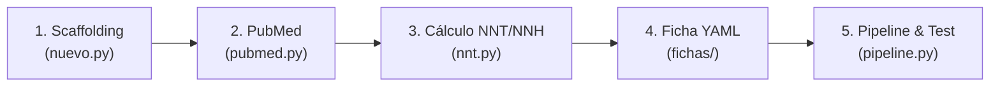

# Protocolo Estandarizado de Producción para LLMs & Agentes (farmacosemiotics)

Este documento define el **contrato determinista de producción**. Cada vez que un modelo de lenguaje (LLM), agente autónomo o colaborador humano cree o actualice un fármaco o ficha terapéutica, debe ejecutar **exactamente este bucle de 5 pasos** sin omitir ninguna fase.

---

## 🔁 El Bucle de Producción en 5 Pasos



---

### Paso 1: Scaffolding Oficial
Genera la plantilla base con identificador consecutivo y autoría unificada:
```bash
# Para principio activo (si no existe previamente en farmacos/):
python scripts/nuevo.py farmaco FS0006 "NombreMolecula" --atc C09AA02

# Para la ficha terapéutica:
python scripts/nuevo.py ficha FT0006 "Título de la Ficha Terapéutica" --farmaco FS0006
```

---

### Paso 2: Resolución de Referencias en PubMed
Toda cifra de eficacia o seguridad **debe provenir de un PMID verificado**.
```bash
# Descarga y valida el ensayo pivote y revisiones sistemáticas:
python scripts/pubmed.py 9742977
python scripts/pubmed.py 20393934
```
*Si un PMID no resuelve o fue retractado, queda prohibido usarlo como soporte.*

---

### Paso 3: Cálculo Cuantitativo Epidemiológico (NNT y NNH)
Utiliza la calculadora oficial para obtener reducciones absolutas, riesgos relativos y NNT/NNH:
* **Eficacia / Beneficio (NNT):**
  ```bash
  python scripts/nnt.py calc --cer 0.15 --eer 0.09
  ```
* **Toxicidad / Daño (NNH):**
  ```bash
  python scripts/nnt.py harm --cer 0.01 --eer 0.03
  ```

---

### Paso 4: Redacción Estructurada del YAML
Completa el fichero `fichas/FTxxxx.yaml` con todos los campos obligatorios:

1. **Autoría oficial:**
   ```yaml
   autores:
     - nombre: Dr. Alcy Edmundo Torres Guerrero
   ```
2. **Decisión Rápida (`decision_clinica`):**
   * `semaforo`: `verde` (primera línea / beneficio neto demostrado), `amarillo` (condicional / segunda línea o beneficio modesto), `rojo` (desfavorable / no recomendado).
   * `perla_prescripcion`: Mensaje conciso y accionable para el médico de primer contacto.
   * `alerta_seguridad_inmediata`: Umbral crítico (eGFR, interacción letal, contraindicación mayor).
3. **Pregunta PICO (`pico`):** `p` (población diana), `i` (intervención), `c` (comparador), `o` (desenlaces duros).
4. **Posología Práctica (`posologia`):** `inicio`, `escalado`, `mantenimiento`, `maxima`, `ajuste_renal`.
5. **Evidencia Cuantitativa (`evidencia`):**
   * Cada desenlace debe declarar: `criticidad` (`critico`, `importante`), `efecto` (con IC 95%), `nnt`, `horizonte_nnt`, `diseno` (`eca`, `revision_sistematica`), `certeza` GRADE (`alta`, `moderada`, `baja`, `muy_baja`), `razones_descenso` (si aplica) y `ref: pmid:XXXXX`.
6. **Seguridad Cuantitativa (`seguridad_cuantitativa`):**
   * Cada evento adverso debe declarar: `evento`, `gravedad` (`leve`, `moderada`, `grave`, `letal`, `mortal`), `tasa_intervencion`, `tasa_control`, `nnh`, `horizonte_nnh`, `conducta` clínica y `ref: pmid:XXXXX`.
7. **Juicio de Balance GRADE (`balance`):** `efectos_deseables`, `efectos_indeseables`, `certeza_global`.
8. **Recomendación (`recomendacion`):** `direccion` (`a_favor`, `en_contra`), `fuerza` (`fuerte`, `condicional`), `enunciado`.
9. **Alternativas (`alternativas`):** Lista con `dci`, `atc`, `lme`, `lme_seccion`, `nota`.
10. **Conclusión (`conclusion`):** Síntesis del balance NNT frente a NNH.

---

### Paso 5: Validación Unificada y Pruebas de Contrato
Ejecuta el pipeline unificado de alto rendimiento:
```bash
python scripts/pipeline.py
```

El pipeline ejecutará automáticamente:
1. `build.py` (Validación de esquemas y regla de oro de PMIDs)
2. `nnt.py check` (Auditoría matemática de congruencia NNT/NNH)
3. `indice.py` (Generación de `index.json`, JSON-LD Schema.org y JATS XML)
4. `reto.py` (Generación de preguntas para el banco de autoevaluación)
5. `sitio.py` (Compilación estática Ghost: `index.html`, `blog.html`, `reto.html`)
6. `test_contrato.py` (20/20 pruebas unitarias)

**Criterio de Aceptación:** El pipeline debe terminar con código de salida `0` sin ningún error ni advertencia antes de realizar `git commit` y `git push`.

